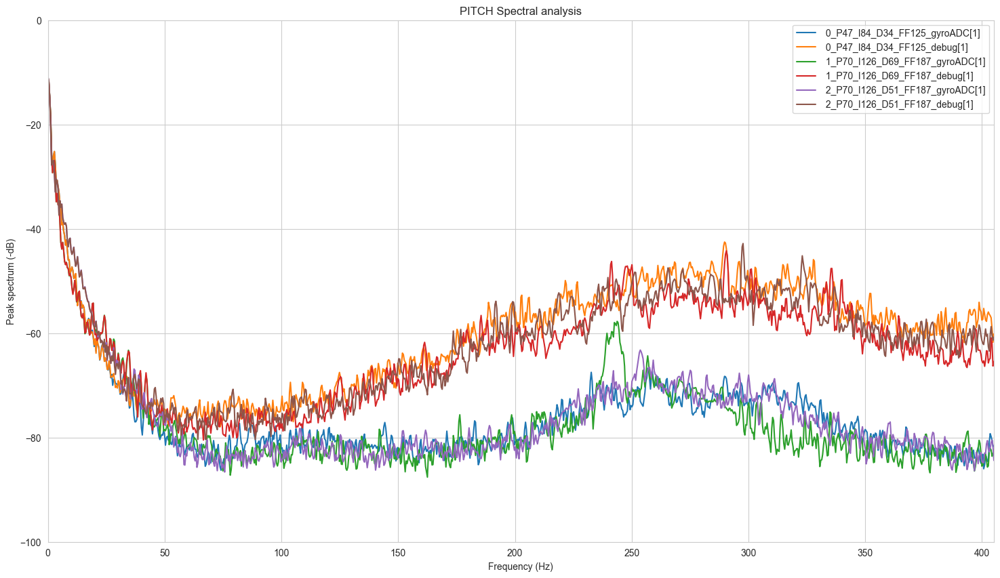
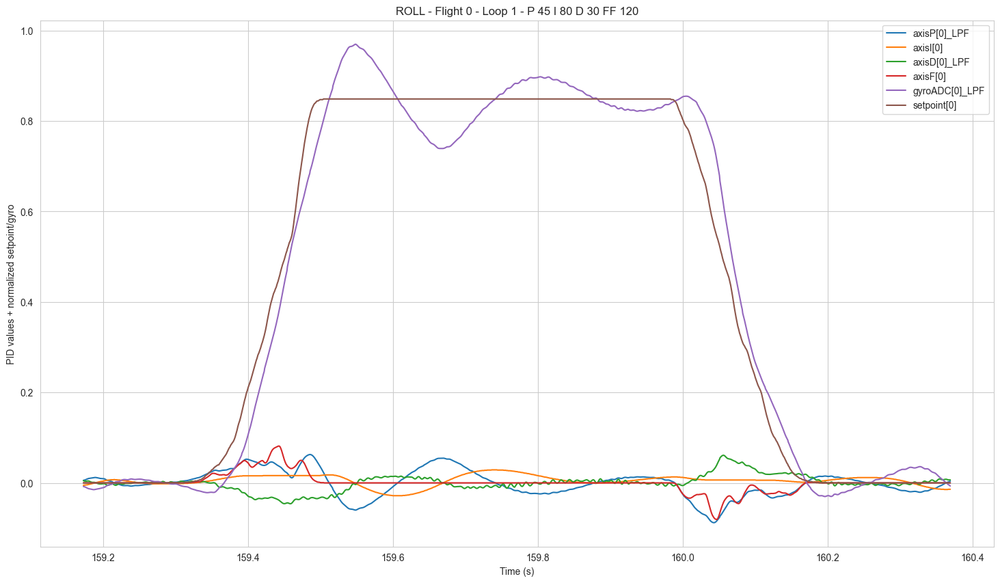
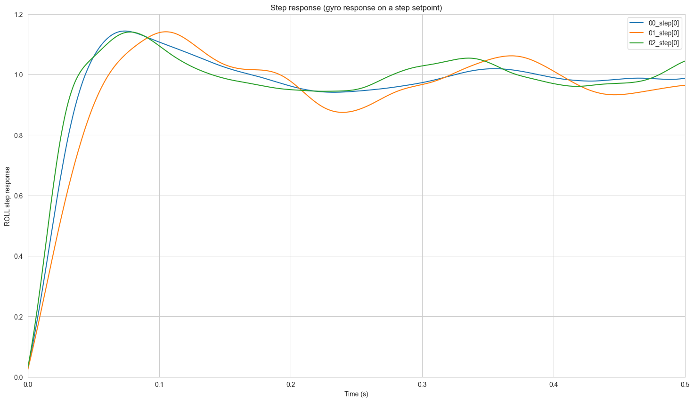

# Blackbox Jupyter

Analyse Betaflight Blackbox data with a Jupyter notebook

## Try it here: [Run this Notebook with Binder.org](https://mybinder.org/v2/gh/yannpom/blackbox-tools/main?labpath=BlackBoxAnalyser.ipynb)

## Introduction

This is a fork of <https://github.com/betaflight/blackbox-tools> to:
- add a Python interface to the existing C decoder.
- provide an interactive Jupyter notebook to plot data

## Features

- Plot the gyro (raw+filtered) and D term "noise"
- Find the flips & rolls and plot them all
- Plot the step response of each axis

## Contribution

Jupyter notebook are great for tinkering, so please have some fun ploting graphs. I would be glad to discuss with you about what plot we can add to improve this notebook. Do not hesitate to push a PR.

## Run the notebook locally

Install the dependencies and start Jupyter:

```bash
pip install -r requirements.txt
jupyter notebook BlackBoxAnalyser.ipynb
```

## Example output




